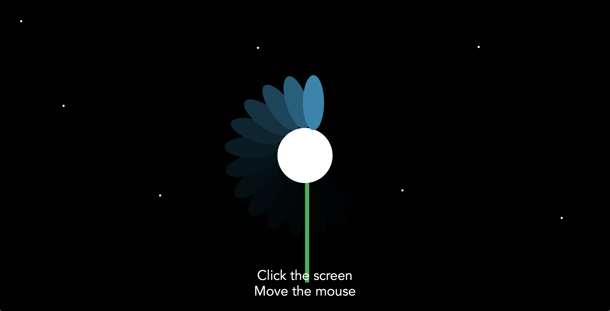

# Mini Exercise 3

Link: https://rawgit.com/lineheeschjessen/Mini-exes/master/mini_ex3/empty-example/index.html

## Description of my program 

My program consists of three throbbers, that look similar to flowers. These throbbers are slightly different in their colors, their speed and the amount of "petals" they have. They look this way, because I wanted to try to associate throbbers with something that is pleasant to look at. Normally throbbers are something we want to avoid, but maybe we could learn to look at them differently. To make the program I used Winnies code, and changed some of it. I wanted to do it this way, because I wanted to understand Winnies code fully, which took me some time. While playing around with the code, the idea of flowers came to me, and so from there I had an idea of something I wanted to visualize. Once I was pleased with the throbbers, I tried to challenge myself to see if I would be able to make a background that would change when you clicked the mouse, stars that would appear and dissapper, as well as a sun. By doing this, I deffinetely think that I learned a lot more that I can use further on, than if I had just made the throbbers. 

I think throbbers are interesting, because they challenge our patience. Normally with progress bars, we know how long we have to wait for something, but with throbbers we don't get any information about this. This is why, I think, throbbers are normally associated with being something negative, because we know we might have to wait for a long time, or maybe the program wont work at all. When I think about the throbbers I usually encounter, they show up on videos if my internet is slow, or on my computer if something doesn't work. I probably encounter a lot more, but I don't think I notice the onces that are there for a short period of time, on a program that actually works. I think throbbers are there mainly to avoid telling us when something doesn't work, so that we believe that if we just wait it will eventually work, and if it doesn't work, it is because we are were not patient enough. I feel like progress bars are made for the users of the program, to give them information on the amount of time they have to wait, while throbbers are made for the makers of the program to conceal when something isn't working. 

I don't think that throbbers are only bad though. They also indicate that something is working, which is a nice feedback to have, if you have to wait. Maybe we should learn to think about the throbber more in this way, to not only think about it as being something we want to avoid. 

