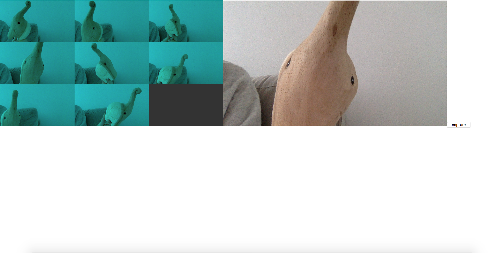

# Mini Exercise 4

Link: https://rawgit.com/lineheeschjessen/Mini-exes/master/mini_ex4/index.html

## Description of my program 

I have made a program that allows you to take pictures of yourself, and the pictures you take will change color. Technically, what has been captured, is a frame from the live video: a picture. It is transferred to the canvas, which allows you to view 8 pictures at a time. When you click the button a photo is taken, as well as a tint being added to the pictures. My original idea was to make all the pictures have different colors, but I could not figure out how to do this, so I settled for all the pictures changing colors. 

## Capturing

Conceptually, was is being captured is a part of our lives: a part that we want to share with others. I am inspired by social media and the pictures and data that we post there. We choose what we want others to see, and hereby also how we want others to perceive us. The added color-effect is supposed to symbolize how we rarely post anything that is completely "raw", we change pictures with filters and special angles, so that we look the way we want to look, and not necessarily the way we actually look. 

My program does not allow you to view yourself the way you actually look, because every photo has an added color-effect. The fact that you can view yourself while you take these photos, and hereby constantly see how you actually look, puts a focus on this difference of reality, and what we choose to post. 

The aspect of capturing in my program is seen in the way the pictures capture a moment. As soon as you press the "capture" button, a picture is taken. The picture is then stored until you take a few other pictures that replaces it. Even though it looks like your pictures disappear as soon as you reach the limit of 8 pictures, this is actually not the case. The pictures are still there, they are just hidden behind a square that looks like the background. This can also help us think about how some media may make it seem like you have full control of the data that you share and allow you to choose whether you want to delete it or not. Although this is often just an illusion, and the data that has been posted will still exist somewhere that you don't get to see, even though you believe that you deleted it. I think this exercise helps me understand the data capturing process in digital culture by putting a focus on it and making me reflect on the data that is being captured of myself.
