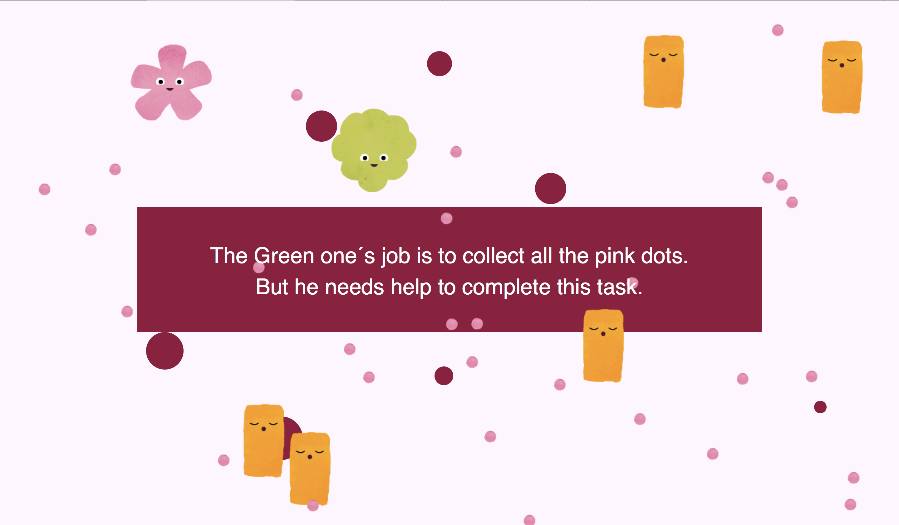

# Mini Exercise 5

Link: https://rawgit.com/lineheeschjessen/Mini-exes/master/mini_ex5/empty-example/index.html

##  Describe how does your game/game object works?

My mini_ex is a simple game where you control the pink sprite by moving the mouse. The objective is to collect all the pink dots, but the pink sprite is not able to do this, and therefore you need to move the green sprite around, in order to make him collect the pink dots for you. When you have collected every last dot, the game is over. There are obstacles that you need to overcome on the way, and these are both distracting floating ellipses in the background, as well as orange rectangles that you can't move. 

I wanted my game to be something that was fun to play, and something that looked quite simple, but had a deeper meaning to it. I found myself being inspired by the subject of inequality between men and women in the workplace, because we discussed this subject in the instructor class on Wednesday. So, what I want to symbolize with my game is how often in big companies, the manly leaders (the green sprite) are not necessarily the ones doing all the hard work, but they are the ones being rewarded the most (the pink dots). Meanwhile their female employees, and the people often not being rewarded equally (the pink sprite), are the ones actually responsible for the growing success of the company. I realize that this is a big generalization, and often this scenario is not real. I personally have not experienced this inequality where I have been working. I just wanted my game to put focus on the cases, in which this situation might be reality. 

## Describe how you program the objects and their related attributes and methods in your game

I wanted my program to be made mainly using the p5.play library. The main reason why I chose to do this was because I wanted to learn how to use it now, so that I would be able to have an understanding of what you are capable of doing with it, and hereby would be able to use it in the future, if I found that it would be useful in some other situation. I used classes to create the floating ellipses in the background, and gave them some attributes and a method. The ellipses are not vital for the gameplay, but they still add something fun in the background. I tried to experience with different classes, but I still find classes very difficult, and I don't think I understand them enough to be able to really use them in the future. 

## What are the characteristics of object-oriented programming?

Object oriented programming is based on the concept of objects that contains attributes and methods. Often these objects are part of classes, that define their type. The attributes of an object can be the actions that it is capable of performing, an interface to access those attributes and actions, or a unique identity. The methods of an object is often constructors or destructors. (Lee, 2013)

*"In the end, the object-oriented method allows us to design and implement a software system more intuitively, compartmentalized, and manageable than previously possible using the classical method."* (Lee, 2013)

## Extend/connect your game project to wider digital culture context

When talking about abstractions, I think that Facebook is a good example to see how these abstractions actually affect us. When we create a profile, there are a lot of information that we have to give about ourselves, but often Facebook has predefined some answers, that are the only ones we are able to pick from. For example, if we are a man or a woman, or what our interest are. This results in Facebook not being a neutral website, where you can define yourself however you want. Instead you have to fit in these predefined categories. As long as you are not able to freely write how you identify yourself, but have to choose from these predefinitions, Facebook can never fully be neutral, but continue to define how we should be. 

