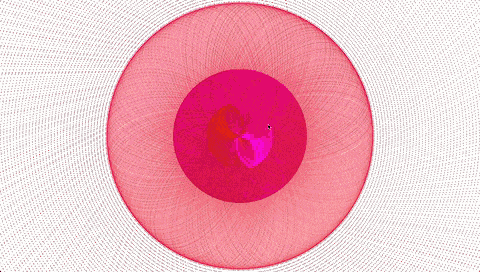

# Mini Exercise 6

Link: https://rawgit.com/lineheeschjessen/Mini-exes/master/mini_ex6/empty-example/index.html

### What are the rules in your generative program and describe how your program performs over time. What have been generated?
There are a few simple rules to my program:

-	It can only exist of ellipses 
-	They have to rotate in the same direction 
-	The background can be changed by the click of the mouse 
-	The program runs forever, and changes its overall appearance over time

My program starts out by drawing several ellipses on top of each other in different sizes, hereby creating a pattern. The pattern changes over time, because the ellipses continuously overlap on top of themselves. Personally, I like the program the best in the beginning, when all the ellipses are most visible, but eventually the program becomes denser and the colors more visible, which also looks alright. When you press the mouse, the background changes color, which I wanted to implement to get two different contrasts to the pattern, and also to give the user a feeling of being a part of creating the pattern. 

### How does this mini-exericse help you to understand what might be generativity? 

I think my program helps me understand generativity in the sense that I get an understanding of the thoughts that you have to put into a generative program. The set of rules that you make determine the outcome of the program, and whether it should be interactive or not. Even though you are the one making the rules, the computer is the one performing them, and you can't really predict what your program will look like once it has run for a while, unless you try it out. So, there is both a sense of control by the use of the predetermined rules, but at the same time also a sense of unpredictability. In relation to this, there are also several ways in which co-authorship becomes relevant in generative programming. First of all, it can be a question of whether the author is the one setting the rules, or if the computer is the author, because it is performing the rules and ultimately creating the "artwork". Further, the notion of authorships becomes difficult when you allow some interactivity in your program, and hereby gives the user a way to change and personalize the program to their interest.   
