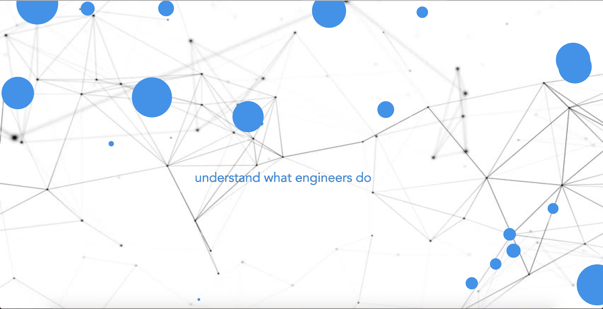

# Mini Exercise 7 - Aesthetic confusion

Link: https://rawgit.com/lineheeschjessen/Mini-exes/master/mini_ex7/empty-example/index.html

#### For this mini exercise Mathilde Friis Nielsen and Line Heesch Jessen collaborated. 

### What is the aesthetic aspects of your program in particular to the relationship between code and language?

This program is called "aesthetic confusion" and is based on the brainstorm that we made together in the first Aesthetic Programming class, focusing on what we believed programming could be used for, and what we related it to. It is a very positive brainstorm that is very useful to look at when things become frustrating, as a reminder of what you want to achieve. But as time has gone by, this very positive perspective on programming has become more faded and confusing, because it often seems to be very hard to achieve. Programming is confusing, hard and sometimes extremely frustrating, and this is what the messy positions of the texts are supposed to illustrate. It illustrates how the things that we wanted to achieve with programming often seems out of reach. At the same time the positive text is still there, it has not been changed to negative thoughts of programming, and this is supposed to illustrate the expectation of hopefully achieving it someday - we will at least continue to try. 

When looking at our program in relation to the general relationship between language and code, I find a few things interesting. The first thing being that when you look at our code, you will notice how it is somehow divided into two languages - one being the language that the computer understands and uses to execute the code, and the other being the language that the computer doesn't necessarily understand. This is seen as the comments in-between the different lines of code explaining what the specific syntaxes are used for and is even seen in the array as the text that is being shown. It is interesting how the entire program revolves around this specific text in the array that the computer displays, but at the same time how the computer doesn't understand what it is displaying. Another thing that I find interesting is the fact that programming language can be used to display our "normal" language in certain ways, and how it can manipulate us to understand it in ways different to how we normally understand it. This can also be seen in our program in that the text is not just static, it moves in a specific motion that is supposed to make you think of the text in a certain way, that you probably wouldn't, if the text was just readily available for you to read. 
