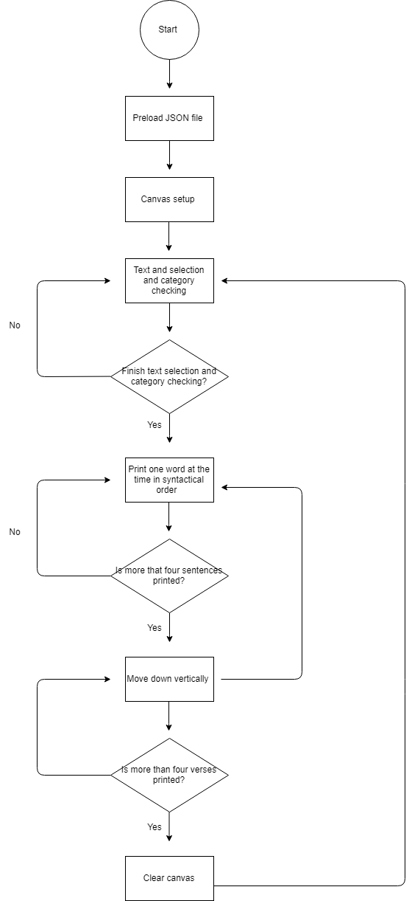

# Mini_ex9

## My own individual flowchart on mini_ex4

Link: https://github.com/lineheeschjessen/Mini-exes/tree/master/mini_ex4

When making this flowchart, what I found difficult was first of all to figure out the amount of detail of the program that I wanted my flowchart to display. I quickly decided to keep it quite simple and leave out any detail that I did not find to be relevant for someone who is not a programmer. The next thing that I found a bit difficult was to figure out how display the process that the program goes through, when it adds the different color-filters, because the color change on every-second click. For this I again chose to make it as simple as possible, to avoid confusion, but it also makes me doubt whether my flowchart is detailed enough.  

## Flowchart on generativity and e-literature idea

The Female Body 

The idea of this program is a generative set of sentences that describe different kind of female bodies, but always end by declaring that the body is beautiful and feminine (or something like that). The sentences will follow a formula for how the sentences are structured to make sure they make sense. The text will be divided into verses constructed of three or four sentences. When the fourth verse has been generated the screen will clear and a new set of verses will be generated. 

## Flowchart on data capture idea

Data capture

The second idea is about data capture using the webcam. We want to create two buttons; a “post” button and a “delete” button. When clicking the “post” button, the picture is posted in the side of the screen. The program will then randomly give the pictures likes. If a picture has less than 5 likes, a text will appear encouraging you to delete this picture. If you click the “delete” button the picture will be deleted and if not it will be kept. 

### The balance between simplicity and complexity 

The balance between simplicity and complicity in our two ideas for our final project, is so that our coded program is made quite simple, whereas our conceptual thoughts about our programs is more complex. We have worked out our ideas by starting with a conceptual idea and theme, and thereby we have brainstormed ideas to illustrate our statements in a simple way. 

### The technical challenges for the two ideas

The technical challenges for our idea about the generativity project, might be to make the text appear the way we want to, and make it generate some sentences that all makes sense, and display them in a speed that makes it possible for the reader to read them properly before they disappear. 

In the other idea about data capture, the technical challenge might be to get our ideas about the like selection and the buttons to work intentionally so that our conceptual idea gets visualized. 

### The difference between my individual flowchart, and our group-made flowcharts

I think the biggest difference between my own flowchart, and the ones we made together is, that the one I made myself is based on a program that already exists, whereas the ones we made together are based on a program that we want to make. This means that my own flowchart may be a bit more technical, whereas the other ones are more conceptual. They are made based on an idea that we find interesting, but we may end out not having the skills to actually make it. 

### Algorithms in a wider cultural contexts

In the text "What is an algorithm?" by Ed Finn, he says: 

"This is the context in which we use algorithms today: as pieces of quotidian technical magic that we entrust with booking vacations, suggesting potential mates, evaluating standardized test essays, and performing many other kinds of cultural work." (p. 16.). 

I find this quote relevant, because I believe that this is the relationship with algorithms that most people have: they don't really know what it is, it is just some kind of magic that works and that we trust, because they make our lives easier a lot of the time. I don't think that many people take the time to think about what is actually going on behind the screen, because we have become so used to relying on the computer to do things for us, but I think it is important for people to have just a general idea of what is happening, because algorithms are becoming such a big part of our everyday lives and culture.
